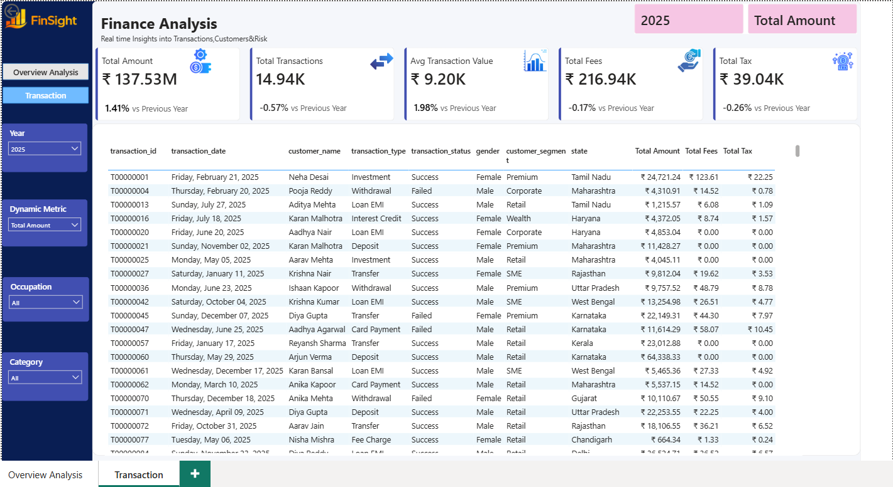
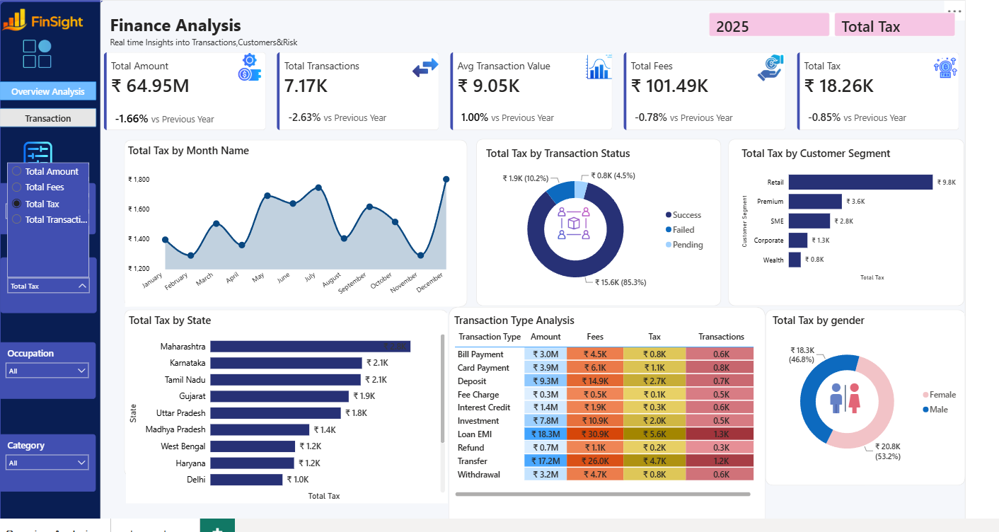
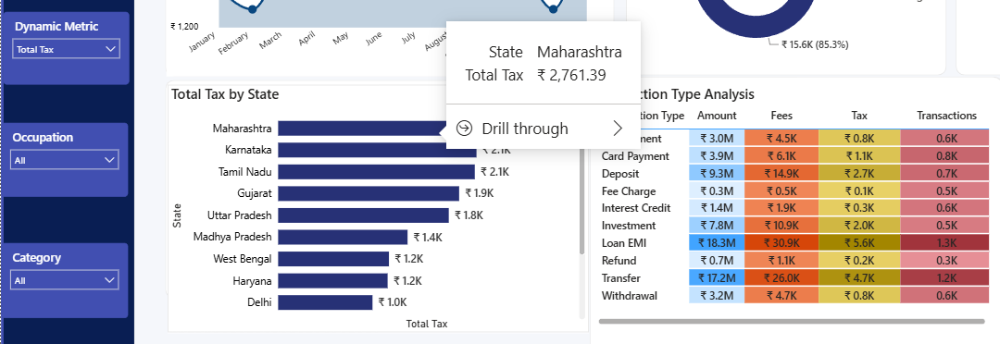

# FinSight – Finance Analysis Dashboard

An interactive Finance Analysis Dashboard built using **Power BI** to monitor financial performance and explore transaction-level insights through dynamic reporting.

## Features

- 2 Interactive Report Pages
- 5 KPI Cards
- 8+ Interactive Visualizations
- Dynamic Slicers
- Cross Filtering
- Drill-through Navigation
- DAX Measures
- Power Query Transformations

## KPIs

- Total Amount
- Total Transactions
- Average Transaction Value
- Average Transaction Value
- Total Fees
- Total Tax

## Tech Stack

- Power BI
- DAX
- Power Query
- Data Modeling
- Data Visualization

## Dashboard Preview

### Overview Dashboard

### Drill-through Analysis

### Transaction Details

### Dynamic Filtering

### Interactive Tooltips

## Repository Contents

- `FinSight.pbix`
- Dashboard screenshots
- README documentation
